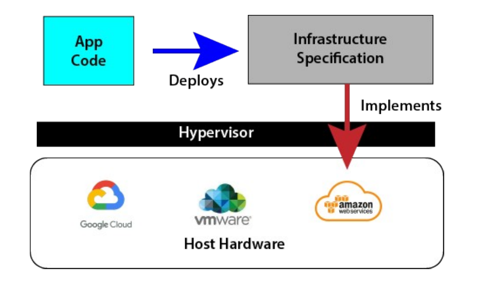
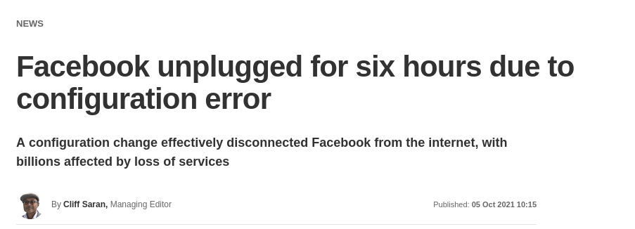
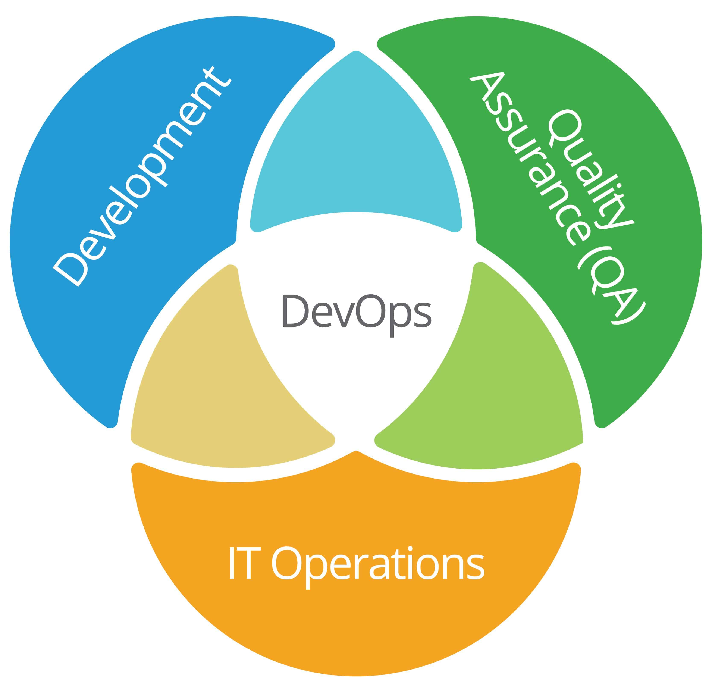
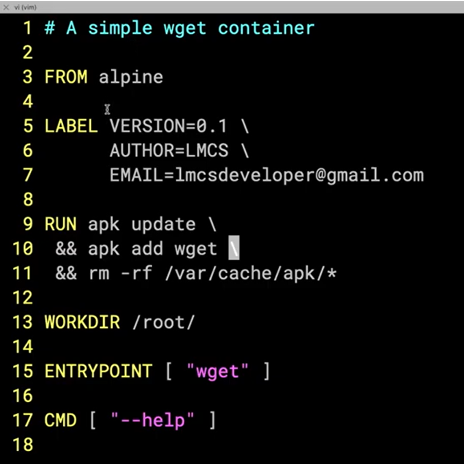
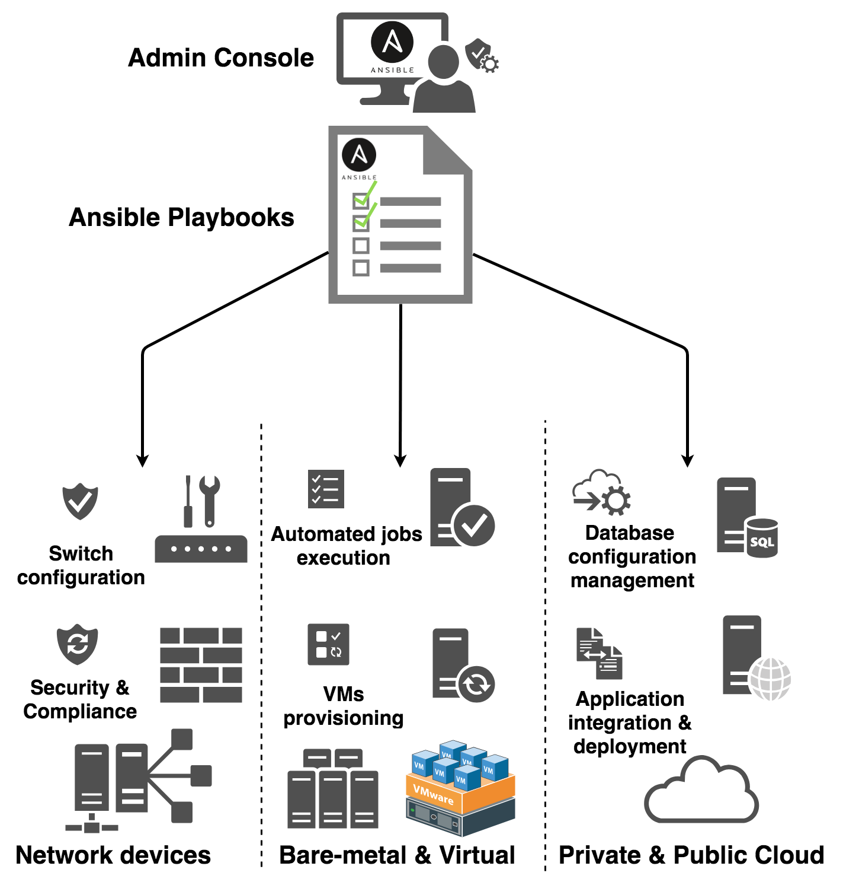

# 01 Terraform Overview

## Why Terraform?

Terraform is an open source Infrastructure as Code (IaC) tool developed by Hashicorp to automate the provisioning of virtual resources across cloud providers.

All cloud providers have some form of IaC available
- AWS has CloudFormation
- Azure has Azure Resource Manager (ARM)
- IBM Cloud has IBM Cloud Schematics

Terraform works across _all_ cloud providers (AWS, Azure, Google, AliBaba, etc.)

- Provides a common vendor-agnostic syntax and application structure for all cloud vendors
- Many organizations nowadays are working with multiple cloud vendors
- Having a common tool with the associated in-house expertise is cost-efficient and operationally effective
- The rise in the popularity of Terraform is because many organizations use multiple cloud vendors, and are having to support in-house skill sets for all the different vendor provisioning tools is pain point that Terraform addresses

## Virtualization and IBM

IBM originated virtualization in 1972 with the introduction of the VM operating systems.


- IBM clients used a varied installed base of hardware and operating systems
- IBM wanted to migrate clients to the MVS/370 mainframe (at the time clients rented hardware)
- Clients balked because all of their software was tightly coupled to the hardware and OS
- The costs of porting over their codebase was prohibitive
- IBM introduced the VM OS that allowed clients to migrate to a MVS/370 but use a virtual version of their existing installation
- The mapping between the VMs and the MVS/370 was done by a _hypervisor_

[IBM VM Operating System](https://en.wikipedia.org/wiki/VM_(operating_system))

---

## On Premises Physical Infrastructure

- On premises (on-prem) physical infrastructure refers to:
    - Physical computers, servers and other devices
    - All associated hardware: cables, routers, switches, disks, etc.
    - Often organized into computer centers or server farms
- Servers are provisioned with the software needed by the users
- Hardware and installed software collectively is _infrastructure_
- The _Dev_ team works with software, the _Ops_ team with infrastructure
- The two groups have different tools, cultures and processes

---

## Rise of Virtualization

- As hardware became more powerful, it also became more efficient to use physical resources to host multiple VMS on a single physical host.
- In the 2000s, a number of tools were introduced that allowed for automation of the deployment of VMs by sending commands directly to the hypervisor
- For a full discussion on virtualization, consult the document in the resources directory: 

---

## Infrastructure as Code

- Infrastructure as code (IaC) refers to being able to issue a series of commands toa hypervisor that generates infrastructure in a virtual environment.
- For example, to create a VM at the command line in Azure Cloud, the imperative commands would look something like this:

```console

RESOURCE_GROUP="MyResourceGroup"
LOCATION="eastus"
VM_NAME="MyLinuxVM"
ADMIN_USERNAME="azureuser"

# Step 1: Create a resource group
az group create --name $RESOURCE_GROUP --location $LOCATION

# Step 2: Create the VM
az vm create \
  --resource-group $RESOURCE_GROUP \
  --name $VM_NAME \
  --image UbuntuLTS \
  --admin-username $ADMIN_USERNAME \
  --generate-ssh-keys

# Step 3: Open port 22 for SSH access
az vm open-port --port 22 --resource-group $RESOURCE_GROUP --name $VM_NAME

```

- The process looks like this




- The programmer or some application deploys an infrastructure specification using code similar to what was just shown
- This produces an infrastructure specification or a description of what needs to be done
- The hypervisor then creates the virtual resources by implementing the specification as a mapping to some allocated physical resources

---

## Declarative IaC

- The example we just looked at is called imperative because it specifies a series of tasks that need to be done to get at the desired deployment.
- With declarative IaC, a description of the end deployment is provided and the IaC tool being used, in this case Terraform, converts the description into executable code
- The previous example in Terraform would look something like this:

```console
terraform {
  required_providers {
    azurerm = {
      source  = "hashicorp/azurerm"
      version = "~> 3.0"
    }
  }

  required_version = ">= 1.0"
}

provider "azurerm" {
  features {}
}

# Step 1: Resource Group
resource "azurerm_resource_group" "rg" {
  name     = "MyResourceGroup"
  location = "eastus"
}

# Step 2: Virtual Network
resource "azurerm_virtual_network" "vnet" {
  name                = "myVnet"
  address_space       = ["10.0.0.0/16"]
  location            = azurerm_resource_group.rg.location
  resource_group_name = azurerm_resource_group.rg.name
}

# Step 3: Subnet
resource "azurerm_subnet" "subnet" {
  name                 = "mySubnet"
  resource_group_name  = azurerm_resource_group.rg.name
  virtual_network_name = azurerm_virtual_network.vnet.name
  address_prefixes     = ["10.0.1.0/24"]
}

# Step 4: Network Security Group with SSH rule
resource "azurerm_network_security_group" "nsg" {
  name                = "myNSG"
  location            = azurerm_resource_group.rg.location
  resource_group_name = azurerm_resource_group.rg.name

  security_rule {
    name                       = "AllowSSH"
    priority                   = 1001
    direction                  = "Inbound"
    access                     = "Allow"
    protocol                   = "Tcp"
    source_port_range          = "*"
    destination_port_range     = "22"
    source_address_prefix      = "*"
    destination_address_prefix = "*"
  }
}

# Step 5: Network Interface
resource "azurerm_network_interface" "nic" {
  name                = "myNIC"
  location            = azurerm_resource_group.rg.location
  resource_group_name = azurerm_resource_group.rg.name

  ip_configuration {
    name


```

Note: Neither of these code examples just presented are intended to be actually executable, they are just illustrative of what the code looks like.

#### Why is Terraform declarative?

- A comparison of the code shows that the Terraform code lists the resources to be created with their properties.
- Terraform figures out the dependencies among the requested resources and generates the imperative commands necessary to create the resources in the right order.

---

## Maintaining and Versioning State

- Terraform keeps a record of what the deployment should look like
- Terraform can query the implemented state of the deployment and compare it against what it should be
- If there are any discrepancies, Terraform can modify the implementation to bring it back into conformance with the specified state
- Terraform does this by generating the code needed to make the changes
- This helps correct any misconfigurations that might arise from _"I'll just change this IP address.. what could possibly go wrong...."_

[Facebook 2021 Config Crash](https://www.computerweekly.com/news/252507717/Facebook-unplugged-for-six-hours-due-to-configuration-error/)

images/Facebookerror.png




- Once we have the specification that describes a desired target state, we can use a repository tool like git to save it
- We can then redeploy any previous configuration if needed
- For example, if the new configuration keeps crashing, but we can roll back to the previous one that worked until we can fix the new wonky configuration

---

## The Rise of DevOps

- Virtualization was a game changer
    - Virtual Machines can _replace on-prem physical servers_
    - This still requires physical hosts, but these can be provisioned automatically
    - Some organizations use a mix of physical hosts and virtual hosts
- Cloud computing eliminates the need for any on-prem physical hardware
    - All the infrastructure is virtual
    - The cloud provider manages all the hardware
- DevOps is the merging of the Dev and Ops roles
    - Developers write code, Ops now writes code
    - DevOps integrates the two roles through common tools
    - Enables _continuous integration_ & _continuous deployment_ (CICD)




---

# Modern Infrastructure

- In a cloud or virtual environment, infrastructure _is_ code
    - Code is run to create virtual resources
    - IaaS (Infrastructure as a Service) refers to virtual networks of virtual devices
- The code we write to create and manage this virtual infrastructure _is_ source code
    - Therefore, it should be managed using the tools developers use for managing source code
    - IaC code can be developed using the same types of methods programmers use for their source code
    - This includes automated testing, versioning and making reusable libraries

---

## Types of IaC Tools

- There are five broad categories of IAC tools:
    - Ad hoc scripts - tools to manage infrastructure on the fly
    - Configuration management tools install and maintain software on physical and virtual hosts
    - Server templating tools and containerization tools
    - Orchestration tools
    - Provisioning tools

---

## Ad Hoc Scripts

* Procedural code written to manage a virtual resource
* Example: AWS CLI commands to create a security group and EC2 instance.


---

## Server Templating Tools

- Tools to handle packaging, configuration and deployment of VMs and containers
    - Examples: Docker, Packer, and Vagrant.




---

## Images and Containers


---

## Virtual Machines vs Containers

#### Virtual machines
- A virtual machine (VM) emulates an entire computer, including the hardware and OS.
- A hypervisor, such as VMWare, VirtualBox, or Parallels virtualizes the underlying CPU, memory, hard drive, and networking of the host system
- Benefit: complete isolation
- Drawback: waste of resources
- You can define VM images as code using tools such as Packer and Vagrant

#### Containers
- A container emulates the user space of an OS
- Run by a container engine, such as Docker, CoreOS rkt, or cri-o, to create isolated processes, memory, mount points, and networking
- Benefit: Very lightweight, small footprint and millisecond boot time
- Drawback, requires a container engine to run, not suitable for large apps so may require an orchestration tool

---

## Orchestration Tools

- Designed to run and coordinate multiple tasks (usually containers) running on multiple hosts
    - Need to keep the overall distributed processing synchronized and robust
    - These are often thought of as "swarms" of hosts/containers that need to be orchestrated
- Example: Kubernetes


---

## Provisioning Tools

- Refers to creating virtual resources from some form of text template, usually JSON
- All cloud providers have some form of provisioning too, like CloudFormation in AWS


  
---

## Configuration Tools

- These are tools that automatically install and configure software on running hosts, virtual or physical
- One of the most commonly used is Ansible, other older ones are Chef and Puppet
- Normally one of these tools will run to install software after Terraform or other provisioning tool has created the infrastructure




---


## Why Infrastructure as Code?

**Speed and simplicity:** Entire deployments can be set up or torn down by running a script

**Configuration consistency:** Identical copies of configurations can be created for testing or development

**Minimization of risk:** Reduces human procedural errors. Allows for testing, reviews and other quality measures

**Increased efficiency in software development:** Infrastructure is not a bottleneck because resources are available as needed

**Cost savings:** Grunt work is automated so expensive people time can be dedicated to the important stuff

---

## The Benefits of Infrastructure as Code

**Self-service:** Infrastructure deployment with scripts does not rely on an administrator or ops engineer

**Speed and safety:** Infrastructure is deployment and updated faster and with fewer errors

**Documentation:** The IaC source files _are_ infrastructure documentation

**Version control:** Previous deployments can be maintained in source control for regression or audit need, or to satisfy regulatory requirements

**Validation:** For every single change, code reviews and dynamic testing can be performed

**Reuse:** New infrastructure deployments can be derived quickly from previous deployments

---

## Lab 01 -Setup

---

## End Module

