# Lab 01 Setting up

## Part 1: Azure Cloudshell

- You can do this in your own Azure account, assuming you have permissions to create resource groups, blob storage and Virtual Machines.
- If not, you can use the provided VM

### Step 1: Getting into your Account
- you will be provided with an account that looks like the following, but will have a number instead of xx
- For the following screenshots, a dummy account `student98` is being used.
- **You will need access to a cell phone to authenticate your account**

```text
account: studentxx@markelephantscale.onmicrosoft.com
pass: Bingobob123
```

### Step 3: Log in

Go to [http://portal.azure.com](http://portal.azure.com)

- Enter the id you were assigned
- Select `Next`

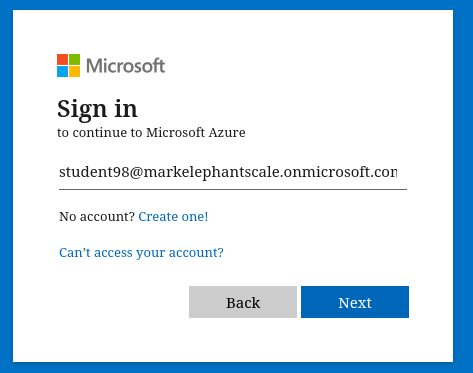

- You will be prompted to enter your password which is `Bingobob123`
- Select `Next`
- You will then be asked to reset your password
- In the screenshot below, I set it to `Bingobob123!`


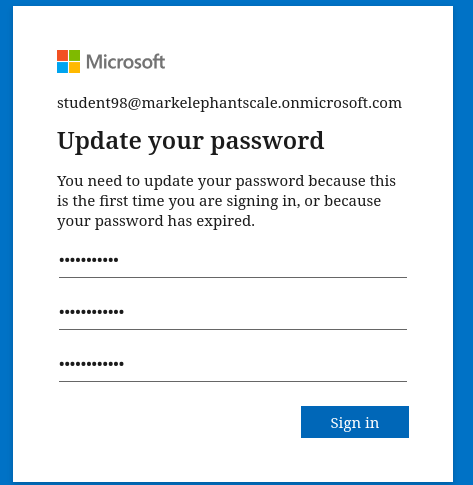

- You will then see the "keep your account secure" dialog
- Select `Next`

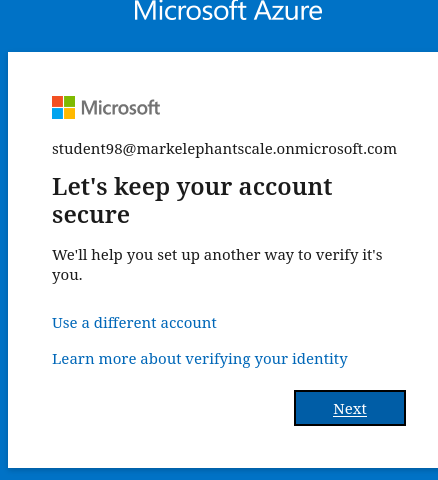

- You will be taken immediately to the `Microsoft Authenticator`
- Select the `I want to set up a different method` option

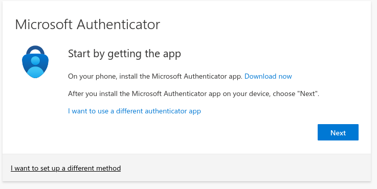

- That will pop up a dialog like this
- Choose the `phone` option

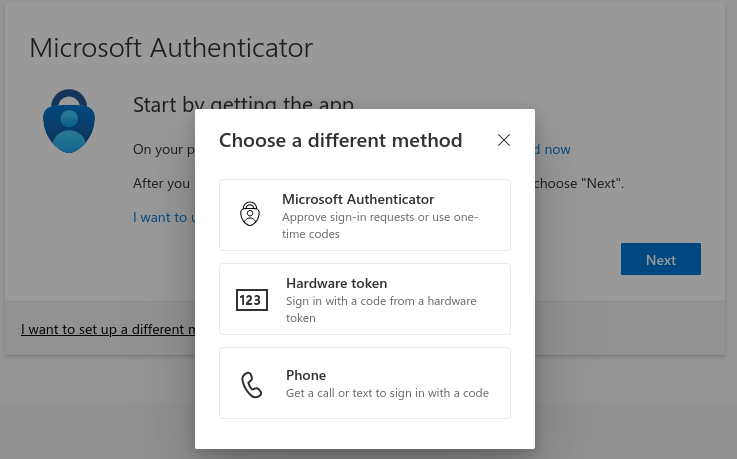

- Enter your cell number and select `Receive a code` 
- Select `Next`

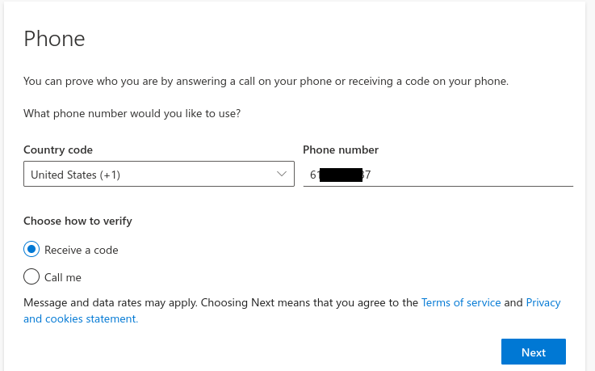

- Enter the code you get and select `Next`

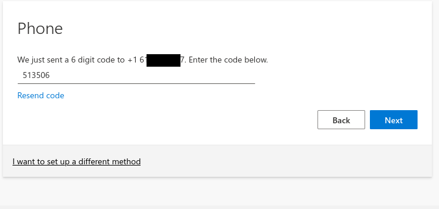

- Select `Done` to finish

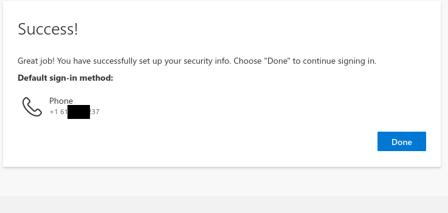

- When asked if you want to stay logged in, select `YES`

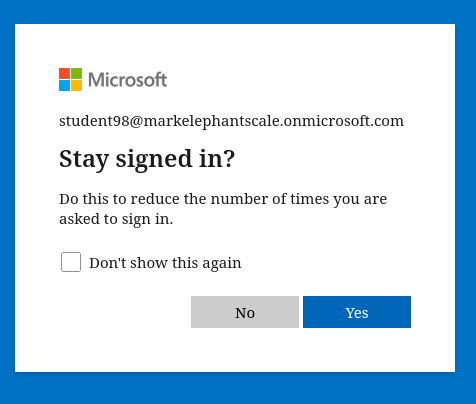

- You should now be logged into Azure

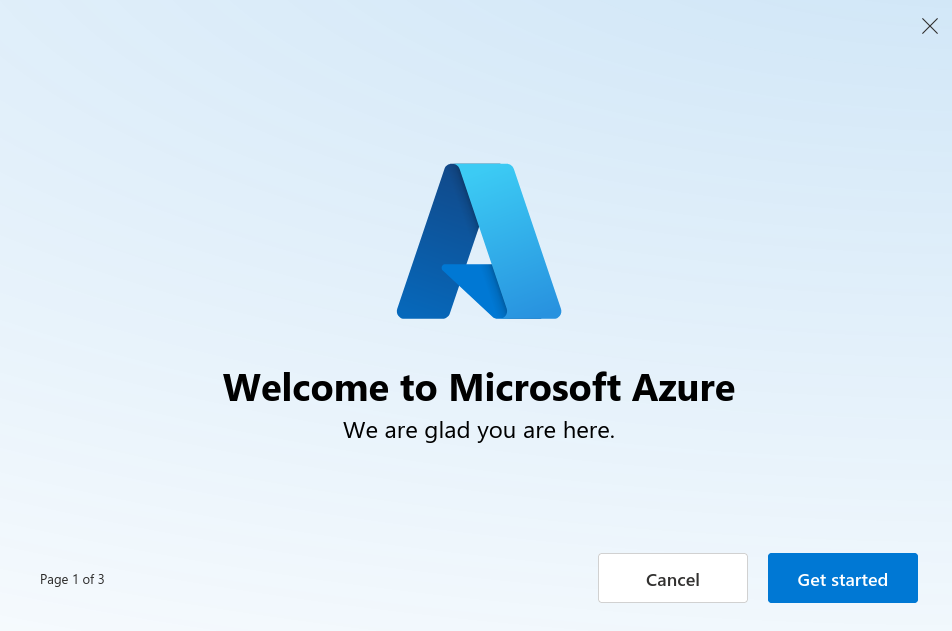

### Step 4: Open the cloud shell

- In the main Azure home page
- Select the `cloud shell` icon on the tool bar, next to the `copilot` idcone

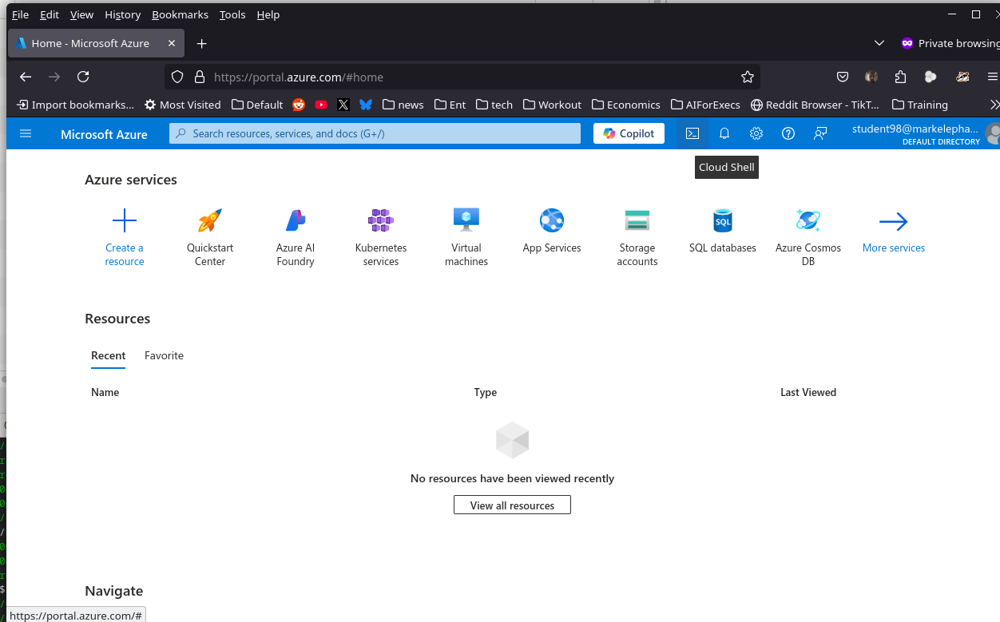

- Select the `Bash` shell

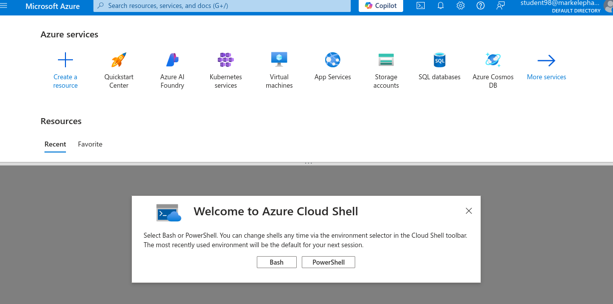

- Select the Subscription from the drop-down list
- Select the No Storage option
- Your configuration should look like this

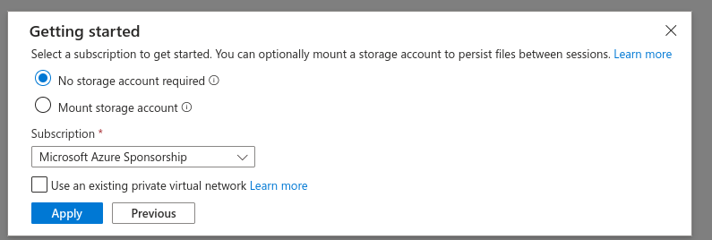

- You should see the shell display

```console
Requesting a Cloud Shell.Succeeded. 
Connecting terminal...

Welcome to Azure Cloud Shell

Type "az" to use Azure CLI
Type "help" to learn about Cloud Shell

Your Cloud Shell session will be ephemeral so no files or system changes will persist beyond your current session.
```

Once the console opens, you can find your id that you to use by executing `az account show`

```console
student98 [ ~ ]$ az account show
{
  "environmentName": "AzureCloud",
  "homeTenantId": "d84eef44-a147-4f60-8a78-01c2c07d347a",
  "id": "fb1c7e89-1238-4b64-9ee0-9df0ad9d0c81",
  "isDefault": true,
  "managedByTenants": [],
  "name": "Microsoft Azure Sponsorship",
  "state": "Enabled",
  "tenantId": "d84eef44-a147-4f60-8a78-01c2c07d347a",
  "user": {
    "cloudShellID": true,
    "name": "student98@markelephantscale.onmicrosoft.com",
    "type": "user"
  }
}
```

### You are ready to go!!

---


## Part 2: Creating the test environment

- Use any text editor you want on your local machine to create the text files specified in the lab.
- Use the file upload option in the file management drop down in the Azure cloud shell environment

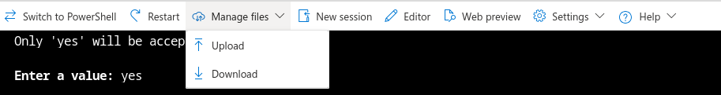

### Create the `providers.tf`

- Open the `providers.tf` file in your editor
- Replace the `subscription` placeholder with your own subscription
- Assume your subscription is 1a145f5-f00d-5289-c413-487764d2886b
- Then your file should look like this

```terraform
terraform {
  required_providers {
    azurerm = {
      source  = "hashicorp/azurerm"
    }
  }
}

provider "azurerm" {
  features {}
  subscription_id = "1a145f5-f00d-5289-c413-487764d2886b"
}

```

- Upload the file to the cloudshell and do an `ls` to ensure it is there.

--- 

## Part 2: Initialize Terraform

- Use the `terraform init` command to create the terraform environment.
- It should look something like this:

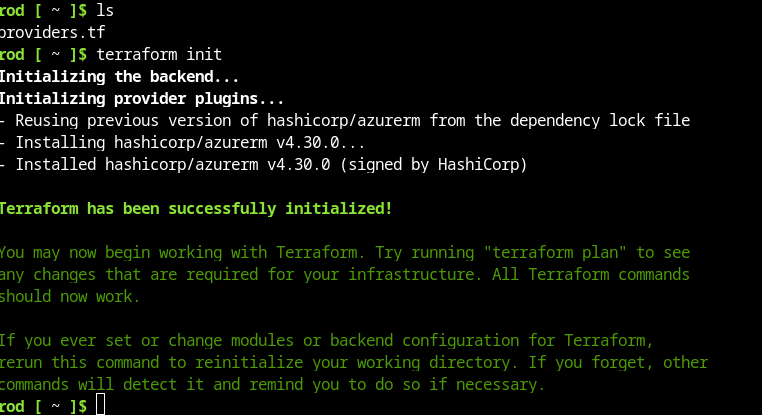 


---

## Part 3: Create a test resource group

- Upload the `main.tf` file provided
- It looks like this

```terraform
# Lab 1 test

resource "azurerm_resource_group" "lab1" {
  name     = "Lab1"
  location = "eastus"
}
```

- All this file does is create a resource group.
- Run `terraform validate` to ensure the file parses correctly

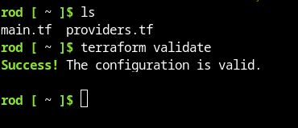

- Now run `terraform apply` and answer `yes` to the prompt
- You should see the following output:

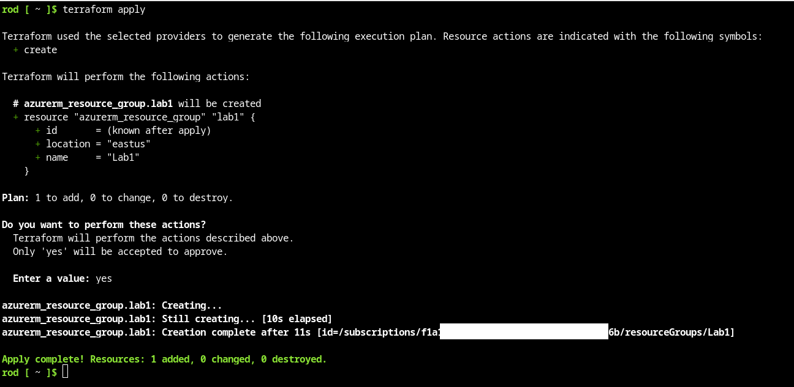

- Confirm in the portal GUI that the resource group has been created by 

---

## Part 4: Destroy the resource group

- In the cloudshell, enter the command `terraform destroy` and answer yes to the prompt

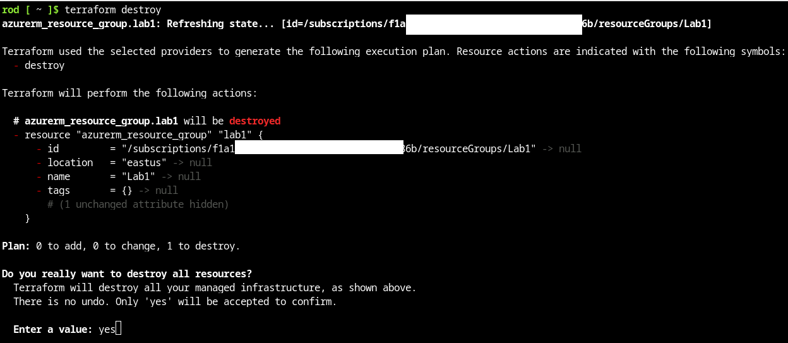

- You should see confirmation like this

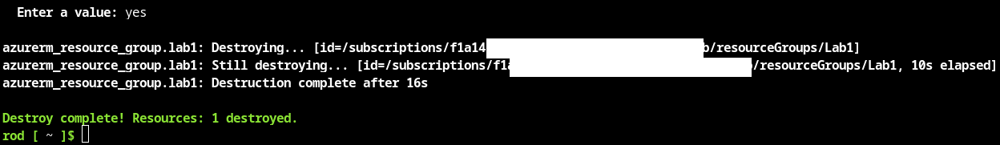

Check in the GUI to confirm that the resource group has been deleted.

---

## End Lab