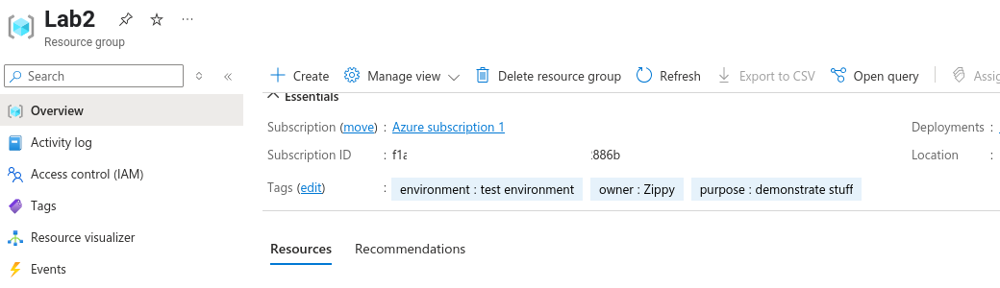

# Lab 2: Terraform Basics

In this lab, you will explore the Terraform workflow process that happens when you define and deploy resources with Terraform

## Part 1: Setup

- Log into your cloud shell like you did before
- Make sure the `providers.tf` file is there, if not upload it again like you did in lab 01
- Run `terraform init` 
- If you have already initialized Terraform, you will see output like this
  - In other words, it will not reinstall the provider modules because of the lock file but will just refresh any missing components

```console
rod [ ~ ]$ terraform init
Initializing the backend...
Initializing provider plugins...
- Reusing previous version of hashicorp/azurerm from the dependency lock file
- Using previously-installed hashicorp/azurerm v4.30.0

Terraform has been successfully initialized!

You may now begin working with Terraform. Try running "terraform plan" to see
any changes that are required for your infrastructure. All Terraform commands
should now work.

If you ever set or change modules or backend configuration for Terraform,
rerun this command to reinitialize your working directory. If you forget, other
commands will detect it and remind you to do so if necessary.
```

#### Why reinitialize?

In these labs, we are using a local state file which is the default configurations
- However, this is _not_ recommended for security and integrity reasons
- Part of the `init` process is to connect the current session to a remote state file which is securely defined someone where else "the backend"

---

## Part 2: Upload the `main.tf` file

- There is a new `main.tf` file in the Lab directory
- Upload this to overwrite the existing `main.tf` file you may have in your cloud shell.

```terraform
# Lab 2 workflow

resource "azurerm_resource_group" "lab2" {
  name     = "Lab2"
  location = "eastus"
  tags = {
      environment = "test environment"
      owner       = "Zippy"
      purpose     = "demonstrate stuff"
    }
}
```

---

## Part 3: Validate

- The `terraform validate` function ensures that all of the tf files are syntactically correct. 

- Running `terraform validate` should show something like this:

```console
rod [ ~ ]$ terraform validate
Success! The configuration is valid.
```

- Normally, validate is run before any other operation is executed that will change the state of the deployed resources.
- But running validate by itself is usually fast and less resource intensive
- And it's a good practice to confirm no corruption exists in your code

- Upload the file `broken.tf`
- It is not syntactically correct because Terraform has no idea what to call this resource in the state file

```terraform
esource "azurerm_resource_group" {
  name     = "broken"
  location = "eastus"
}
```

- Running `terraform validate` again shows the syntax error

```console

rod [ ~ ]$ terraform validate
╷
│ Error: Missing name for resource
│ 
│   on broken.tf line 1, in resource "azurerm_resource_group":
│    1: resource "azurerm_resource_group" {
│ 
│ All resource blocks must have 2 labels (type, name).
╵
```

- Remove the file `broken.tf` and rerun validate to ensure your files are good to go


## Part 4: Plan

- The command `terraform plan` is where Terraform
  - Gets the current state of the Azure environment
  - Compares it to what has been requested in the `*.tf` files
  - Create a plan for execution to bring the state of the Azure resources into sync with the requested state in the `*.tf`
- `terraform plan` does not do anything to the deployment; it just describes what it is going td

Execute `terraform plan` and you should see this output

```console
 terraform plan

Terraform used the selected providers to generate the following execution plan. Resource actions are indicated with the following symbols:
  + create

Terraform will perform the following actions:

  # azurerm_resource_group.lab2 will be created
  + resource "azurerm_resource_group" "lab2" {
      + id       = (known after apply)
      + location = "eastus"
      + name     = "Lab2"
      + tags     = {
          + "environment" = "test environment"
          + "owner"       = "Zippy"
          + "purpose"     = "demonstrate stuff"
        }
    }

Plan: 1 to add, 0 to change, 0 to destroy.

Note: You didn't use the -out option to save this plan, so Terraform can't guarantee to take exactly these actions if you run "terraform apply" now.
```

Last line just means that if we run `terraform apply`, something might have changed in the `*.tf` files and a different plan might actually be executed.


## Part 5: Apply

- The command `terraform apply` runs `validate`, then `plan`, then makes the changes in the Azure environment.
- Execute `terraform apply` and you should see the following results


```console
terraform apply

Terraform used the selected providers to generate the following execution plan. Resource actions are indicated with the following symbols:
  + create

Terraform will perform the following actions:

  # azurerm_resource_group.lab2 will be created
  + resource "azurerm_resource_group" "lab2" {
      + id       = (known after apply)
      + location = "eastus"
      + name     = "Lab2"
      + tags     = {
          + "environment" = "test environment"
          + "owner"       = "Zippy"
          + "purpose"     = "demonstrate stuff"
        }
    }

Plan: 1 to add, 0 to change, 0 to destroy.

Do you want to perform these actions?
  Terraform will perform the actions described above.
  Only 'yes' will be accepted to approve.

Do you want to perform these actions?
  Terraform will perform the actions described above.
  Only 'yes' will be accepted to approve.

  Enter a value: yes

azurerm_resource_group.lab2: Creating...
azurerm_resource_group.lab2: Creation complete after 9s [id=/subscriptions/f1a1xxxxxxxxxxxxxxxxxxxxxxxxxxxxxx6b/resourceGroups/Lab2]

Apply complete! Resources: 1 added, 0 changed, 0 destroyed.

```

Go to the GUI and confirm the RG has been created



## Part 6: Destroy

- Now we destroy the RG using the command `terraform destroy`
- Like apply, it will inventory the resources it has created and undo what it did when it executed the `terraform apply` command
- Execute `terraform destroy` and answer yes to the prompt
- Your output should look like this.


```console
terraform destroy
azurerm_resource_group.lab2: Refreshing state... [id=/subscriptions/f1a145f5-f75d-4170-a316-576364d2886b/resourceGroups/Lab2]

Terraform used the selected providers to generate the following execution plan. Resource actions are indicated with the following symbols:
  - destroy

Terraform will perform the following actions:

  # azurerm_resource_group.lab2 will be destroyed
  - resource "azurerm_resource_group" "lab2" {
      - id         = "/subscriptions/f1xxxxxxxxxxxxxxxxxxxxxxxxxxxxxx886b/resourceGroups/Lab2" -> null
      - location   = "eastus" -> null
      - name       = "Lab2" -> null
      - tags       = {
          - "environment" = "test environment"
          - "owner"       = "Zippy"
          - "purpose"     = "demonstrate stuff"
        } -> null
        # (1 unchanged attribute hidden)
    }

Plan: 0 to add, 0 to change, 1 to destroy.

Do you really want to destroy all resources?
  Terraform will destroy all your managed infrastructure, as shown above.
  There is no undo. Only 'yes' will be accepted to confirm.

  Enter a value: yes

azurerm_resource_group.lab2: Destroying... [id=/subscriptions/f1a145f5-f75d-xxxxxxxxxxxxxxxxxx886b/resourceGroups/Lab2]
azurerm_resource_group.lab2: Still destroying... [id=/subscriptions/f1a145f5-f7xxxxxxxxxxxxxxxxxxxxx886b/resourceGroups/Lab2, 10s elapsed]
azurerm_resource_group.lab2: Destruction complete after 16s

Destroy complete! Resources: 1 destroyed.
```
Confirm in the GUI that the RG no longer exists.


## End Lab